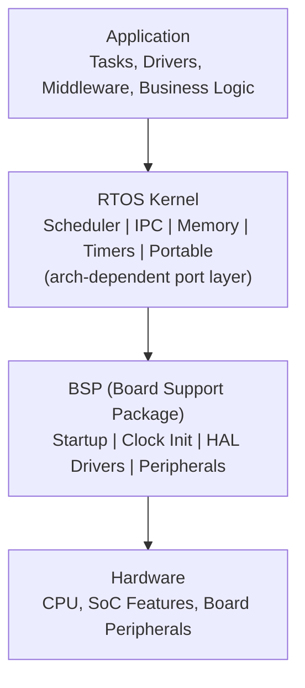
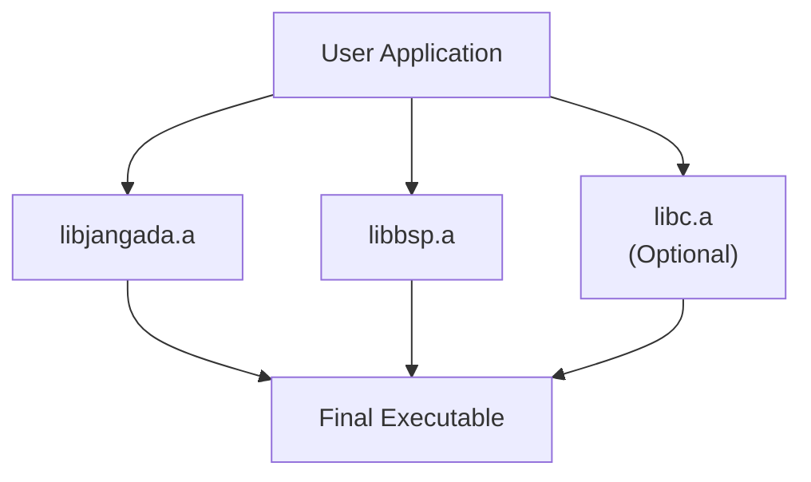
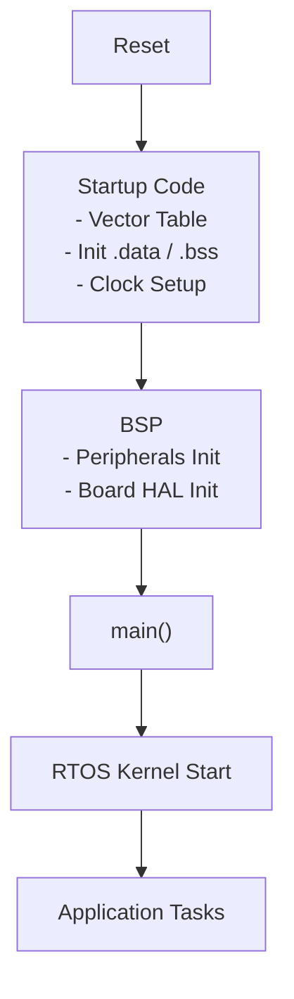
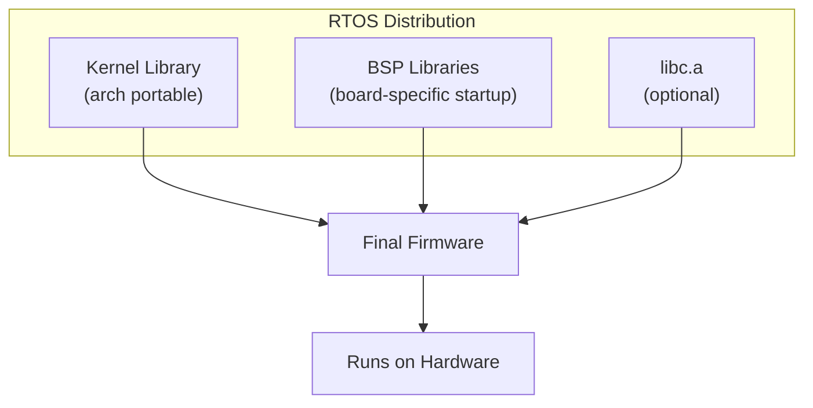

# Architecture
## 1. Layering (Kernel + BSP + Libc + App)

```mermaid
graph TB
    App["Application<br/>Tasks, Drivers, Middleware, Business Logic"]
    Kernel["RTOS Kernel<br/>Scheduler | IPC | Memory | Timers | Portable<br/>(arch-dependent port layer)"]
    BSP["BSP (Board Support Package)<br/>Startup | Clock Init | HAL Drivers | Peripherals"]
    HW["Hardware<br/>CPU, SoC Features, Board Peripherals"]
    
    App --> Kernel
    Kernel --> BSP
    BSP --> HW
```

## 2. Library-based Distribution Layout

```mermaid
graph TB
    UserApp["User Application"]
    Kernel["libjangada.a"]
    BSP["libbsp.a"]
    Libc["libc.a<br/>(Optional)"]
    Final["Final Executable"]
    
    UserApp --> Kernel
    UserApp --> BSP
    UserApp --> Libc
    Kernel --> Final
    BSP --> Final
    Libc --> Final
```

## 3. Startup Sequence View

```mermaid
graph TB
    Reset["Reset"]
    Startup["Startup Code<br/>- Vector Table<br/>- Init .data / .bss<br/>- Clock Setup"]
    BSP["BSP<br/>- Peripherals Init<br/>- Board HAL Init"]
    Main["main()"]
    RTOS["RTOS Kernel Start"]
    Tasks["Application Tasks"]
    
    Reset --> Startup
    Startup --> BSP
    BSP --> Main
    Main --> RTOS
    RTOS --> Tasks
```

## 4. Modularity Overview

```mermaid
graph TB
    subgraph Distribution["RTOS Distribution"]
        Kernel["Kernel Library<br/>(arch portable)"]
        BSP["BSP Libraries<br/>(board-specific startup)"]
        Libc["libc.a<br/>(optional)"]
    end
    
    Firmware["Final Firmware"]
    Hardware["Runs on Hardware"]
    
    Kernel --> Firmware
    BSP --> Firmware
    Libc --> Firmware
    Firmware --> Hardware
```